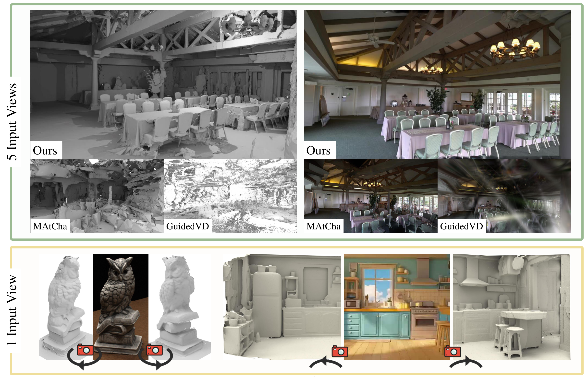
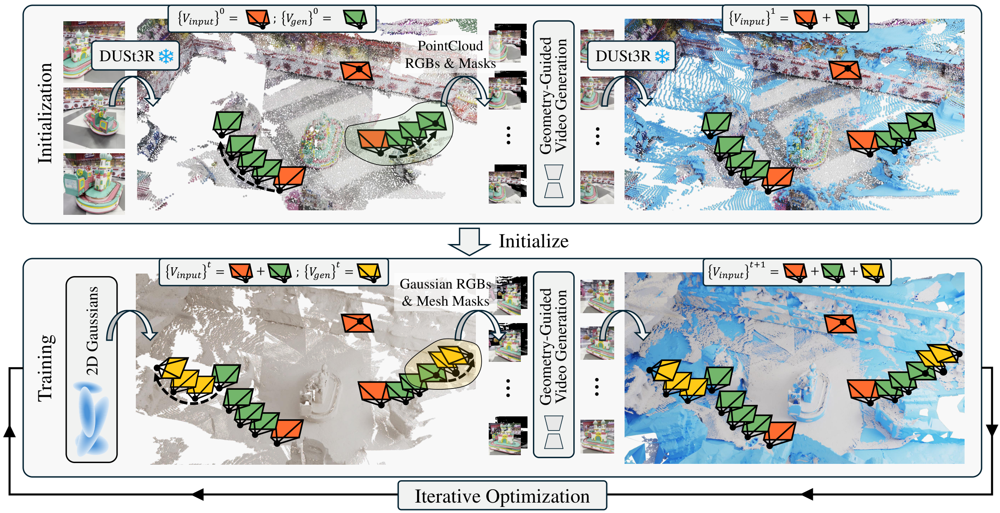
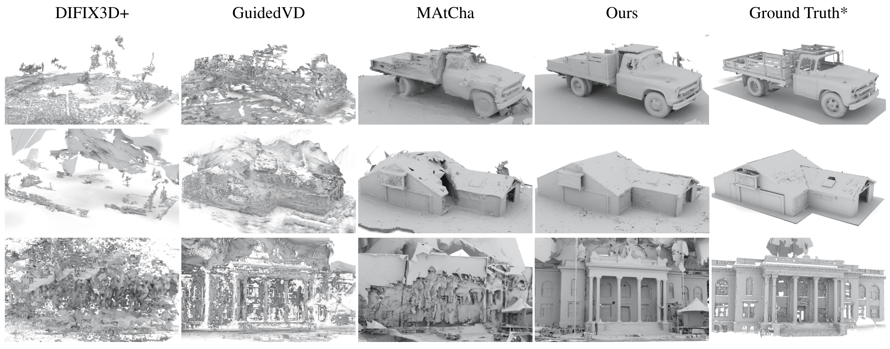
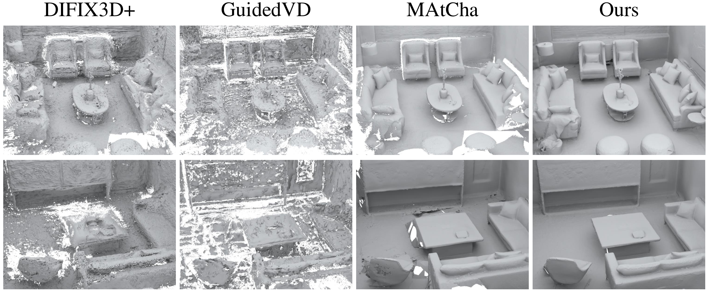
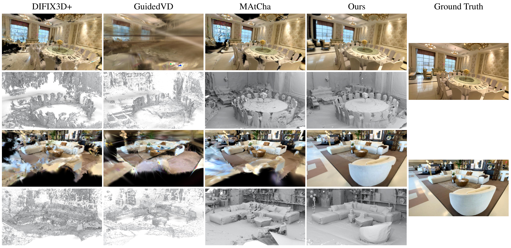
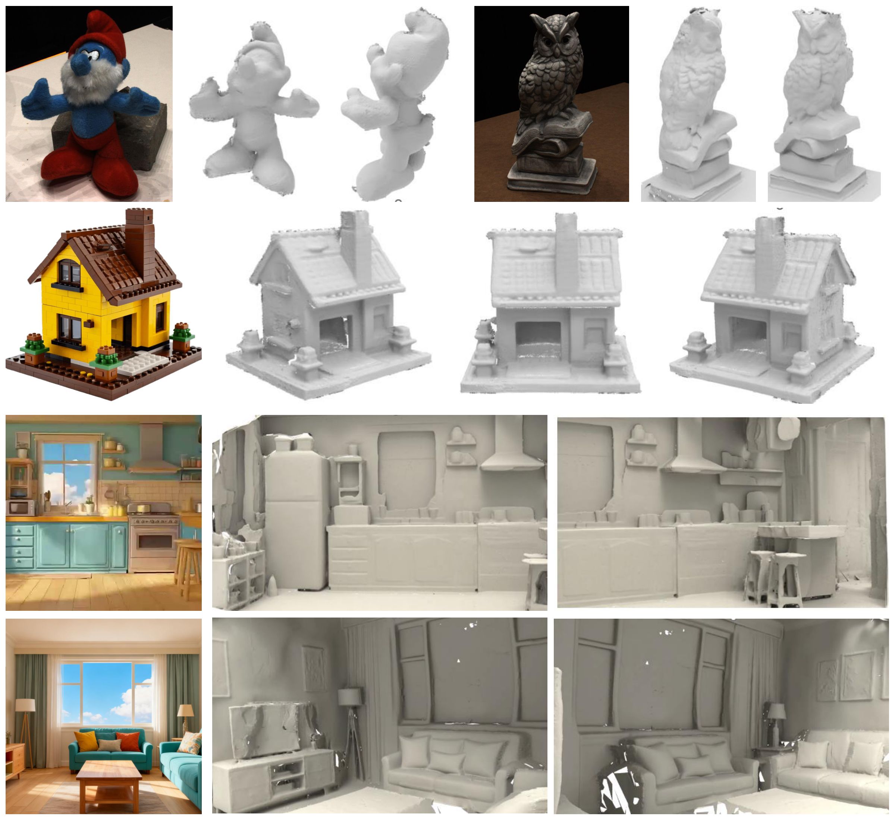

# VidSplat: Gaussian Splatting Reconstruction with Geometry-Guided Video Diffusion Priors

### [Project Page](https://tangjm24.github.io/VidSplat) | [Paper (ArXiv)](https://arxiv.org/abs/xxxx.xxxxx) | [Video](https://youtu.be/xxxx)

> **VidSplat: Gaussian Splatting Reconstruction with Geometry-Guided Video Diffusion Priors**
>
> [Jimin Tang](https://tangjm24.github.io/)\*,
> [Wenyuan Zhang]()\*,
> Junsheng Zhou,
> Zian Huang,
> Kanle Shi,
> Shenkun Xu,
> [Yu-Shen Liu](https://yushen-liu.github.io/)†,
> [Zhizhong Han](https://h312h.github.io/)
>
> School of Software, Tsinghua University &nbsp;|&nbsp; Kuaishou Technology &nbsp;|&nbsp; Wayne State University
>
> \* Equal contribution &nbsp;&nbsp; † Corresponding author
>
> **SIGGRAPH 2026 Conference Paper**

<p align="center">
  
</p>

We highlight the strength of **VidSplat** in large-scale scene reconstruction and novel view synthesis using only 5 input views (top), where recent sparse-view reconstruction methods fail to recover reasonable surfaces. We also demonstrate our ability to generate a complete scene from a single input image, either with all-around coverage (bottom-left) or outward-expanding completion (bottom-right).

## Abstract

Gaussian Splatting has achieved remarkable progress in multi-view surface reconstruction, yet it exhibits notable degradation when only few views are available. Although recent efforts alleviate this issue by enhancing multi-view consistency to produce plausible surfaces, they struggle to infer unseen, occluded, or weakly constrained regions beyond the input coverage. To address this limitation, we present **VidSplat**, a training-free generative reconstruction framework that leverages powerful video diffusion priors to iteratively synthesize novel views that compensate for missing input coverage, and thereby recover complete 3D scenes from sparse inputs. Specifically, we tackle two key challenges that enable the effective integration of generation and reconstruction. First, for 3D consistent generation, we elaborate a training-free, stage-wise denoising strategy that adaptively guides the denoising direction toward the underlying geometry using the rendered RGB and mask images. Second, to enhance the reconstruction, we develop an iterative mechanism that samples camera trajectories, explores unobserved regions, synthesizes novel views, and supplements training through confidence weighted refinement. VidSplat performs robustly to sparse input and even a single image. Extensive experiments on widely used benchmarks demonstrate our superior performance in sparse-view scene reconstruction.

## Method Overview

<p align="center">
  
</p>

Given sparse input views, we sample novel camera trajectories and employ a camera-controlled video diffusion model (VDM) with our geometry-guided denoising strategy to generate additional views. In the initialization stage, RGB and mask images rendered from point cloud are used as VDM inputs, and the generated views are used to complete the initial point cloud. In the training stage, Gaussian-rendered RGBs and mesh-rendered masks are used as inputs, and the generated views are used to expand the training view set.

## Code

> **Code coming soon!** We are cleaning up the codebase and will release it shortly. Stay tuned!

## Results

### Surface Reconstruction on TanksAndTemples

<p align="center">
  
</p>

### Surface Reconstruction on Replica

<p align="center">
  
</p>

### Novel View Synthesis on DL3DV

<p align="center">
  
</p>

### Single-View Reconstruction

<p align="center">
  
</p>

## BibTeX

If you find this work useful, please consider citing:

```bibtex
@inproceedings{tang2026vidsplat,
  title     = {VidSplat: Gaussian Splatting Reconstruction with Geometry-Guided Video Diffusion Priors},
  author    = {Tang, Jimin and Zhang, Wenyuan and Zhou, Junsheng and Huang, Zian and Shi, Kanle and Xu, Shenkun and Liu, Yu-Shen and Han, Zhizhong},
  booktitle = {Special Interest Group on Computer Graphics and Interactive Techniques Conference Conference Papers (SIGGRAPH Conference Papers '26)},
  year      = {2026},
  doi       = {10.1145/3799902.3811138},
}
```

## Acknowledgements

Our code is built upon [2DGS](https://github.com/hbb1/2d-gaussian-splatting), [MAtCha](https://github.com/amandinesandwormatcha/matcha-gaussian-splatting), [DUSt3R](https://github.com/naver/dust3r), and [Wan2.1](https://github.com/Wan-Video/Wan2.1). We thank the authors for their excellent work.

This work was partially supported by Deep Earth Probe and Mineral Resources Exploration -- National Science and Technology Major Project (2024ZD1003405), the National Natural Science Foundation of China (62272263), and in part by Kuaishou.

## License

This project is licensed under the Apache License 2.0 - see the [LICENSE](LICENSE) file for details.
